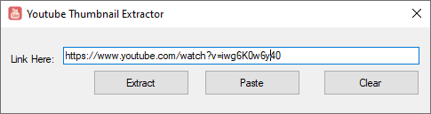

# Youtube Video Thumbnail Extractor C#
Extracts Youtube Video Thumbnail By Providing URL. Extracted Thumbnail can be used for several other purposes.

The project is created in Windows c# forms. The purpose of this tool is to extract thumbnails of videos. The extracted thumbnail can be used for several marketing and distribution reasons. I extract thumbnails to make better visualization in Photoshop or cut out some required image this might not be available on google image search results. This project can be used for research purposes like finding videos on the basis of thumbnails that contain particular text or object using OCR,NLP along with machine learning and Artificial Intelligence Techniques.

This repo contains 2 archives. One is source code, other is executable you may test the working of software.

<b> How to use: </b> 
Copy URL of video for which you want to extract thumbnail. The url must contain "watch?v=" as whole code is based on it. The extracted thumbnail will be presented in default web browser.

<b> Known Issues: </b> 
The thumbnail of private and unlisted videos cannot be extracted.

<b> Preview Of Software:</b> 

